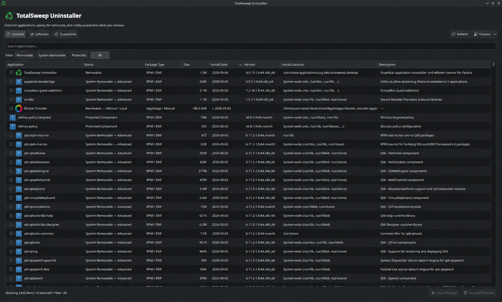
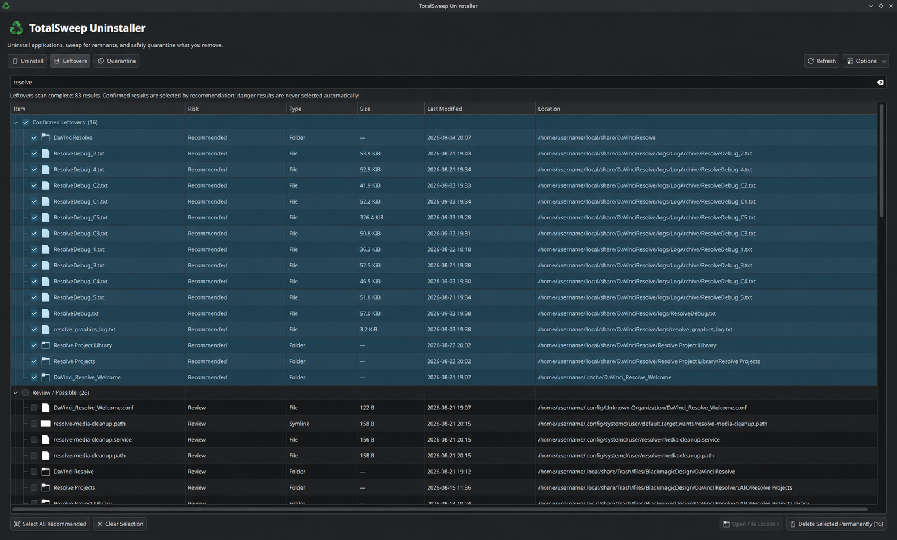
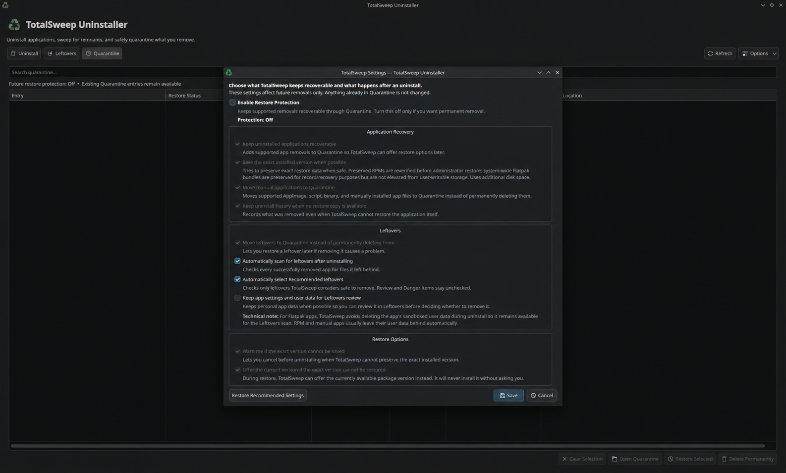

<h1> TotalSweep Uninstaller</h1>

TotalSweep Uninstaller is a graphical uninstaller made for **Fedora** and is currently built and tested on **Fedora 44 KDE Plasma**.

TotalSweep was made to give you an easier way to see what is installed on your system and manage it without having to dig through terminal commands. You can uninstall apps, search for the files they leave behind, quarantine those files instead of deleting them right away and restore them later when possible.

It is especially useful if you prefer using a GUI, are not very comfortable with the terminal, or are coming from another operating system where you are used to managing your apps visually.

## Screenshots

**Uninstall**



**Leftovers**



**Quarantine**



## Install TotalSweep

Download `TotalSweep-Uninstaller-8.9.13.rpm` from the latest release.

The command below works if the RPM was downloaded to your `Downloads` folder:

```bash
sudo dnf install "$HOME/Downloads/TotalSweep-Uninstaller-8.9.13.rpm"
```

If you downloaded the RPM somewhere else, replace the path in the command with the actual location of the downloaded file.

## How TotalSweep Works

### Uninstall

The Uninstall tab gives you a graphical view of the apps TotalSweep can find on your system.

It works with:

- RPM / DNF apps
- Flatpak apps
- manual/local apps that TotalSweep is able to identify safely

You can search through them, select one or multiple apps and uninstall them from the same place. TotalSweep can also show you things that may not normally show up in an app store, including system packages and dependencies.

> ## **IF YOU DON'T KNOW WHAT SOMETHING IS, DON'T REMOVE IT.**

There are protections in place for important system packages, but you should still know what you are removing.

### Leftovers

After uninstalling an app, TotalSweep can search your system for files and folders that look like they were left behind by that app.

You can also use the Leftovers tab on its own to manually search for files and folders you want to clean up, even when you aren't uninstalling an app.

It separates them into:

- **Confirmed Leftovers**
- **Review / Possible**
- **Danger — Possibly Unrelated**

The higher-risk results are not automatically selected.

Even with the files that **are** automatically selected, take a second and look through them before you remove anything. TotalSweep tries to be careful about what it marks as safe, but there is always a small chance a file could be related to something else.

### Quarantine and Restore

Instead of permanently deleting supported leftover files right away, TotalSweep can move them into Quarantine. This gives you a chance to restore them if you realize later that you needed something.

TotalSweep can also save restore information for things like:

- RPM apps
- Flatpak apps
- manual/local apps
- leftover files

What can actually be restored depends on what was saved when it was removed. Because of that, **restoring something is not always guaranteed**. You can also permanently delete things from Quarantine when you know you no longer need them.

## Other things TotalSweep can do

- uninstall multiple apps at once
- quarantine, restore or delete multiple files at once
- keep a history of what you removed
- keep track of your Quarantine sessions
- preserve restore information when Restore Protection is enabled
- change how aggressive or careful leftover scanning is
- follow your KDE/Qt system theme
- remember your table layouts and other interface settings

TotalSweep is currently made for Fedora. Other Linux distributions are not supported yet.

If you want to read more about the safety checks and how TotalSweep handles administrator access, see [SECURITY.md](SECURITY.md).
